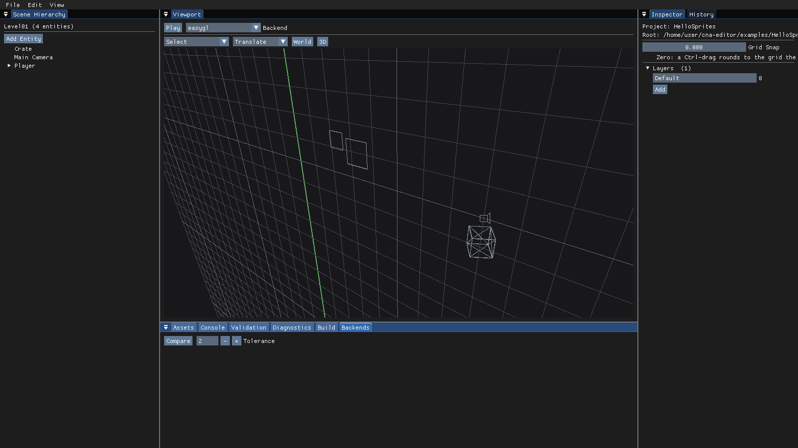

# CNA Studio

A professional game-authoring environment for [CNA](https://github.com/libcna/cna) — the C++
reimplementation of the XNA 4.0 framework.

> **Status: early.** CNA Studio was bootstrapped on 2026-09-14 from the CNA Editor prototype
> developed in `cna-lab` (see [`docs/ORIGIN.md`](docs/ORIGIN.md)). That prototype is real, working
> software — it opens projects, edits scenes, drives gizmos, imports glTF, plays the game in a
> separate process and builds it — and it is the foundation this product is being built on. What is
> *new* is the goal: CNA Studio is a long-lived professional tool, not a prototype, and the roadmap
> to get there is [`plan.md`](plan.md).
>
> The default build stays dependency-free: no CNA checkout, no GPU, no window, 566 assertions
> across 17 CTest suites in about seven seconds.


The 3D viewport, orbited, with the example project's imported `Crate.gltf` standing in the grid
beside the two sprites.



---

## The one rule that shapes everything

> **CNA Studio produces CNA games, not CNA Studio games.**

A game authored in CNA Studio is an ordinary CNA C++ project. You can open it in CLion, configure
it with its own `CMakeLists.txt`, build it with ordinary tools and ship it — with CNA Studio
uninstalled. Studio is an authoring environment and a productivity multiplier; it is never a
runtime dependency, never a mandatory build step, and never an opaque container the game lives
inside.

```
CNA Studio                          ← authoring environment (this repository)
    ↓  produces
CNA game project                    ← ordinary C++: source, assets, scenes, CMake
    ↓  builds against
CNA                                 ← the framework
    ↓  runs on
platform + renderer + audio + input
```

CNA must be able to survive without CNA Studio. A game must be able to survive without CNA Studio.
Every architectural decision in this repository is tested against those two sentences.

---

## What it is

CNA Studio is **not** a new engine, and it is not part of CNA. It is a set of tools *on top of*
CNA, built against the same public API a game uses:

- a **document editor** — scenes, entities, components, undo;
- an **asset pipeline** — stable ids, importers, dependency tracking;
- a **runtime bridge** — play mode in a separate `cna-player` process;
- a **plugin SDK** — importers, component types, panels, gizmos, exporters.

A project declares which kind it is, so a pure XNA-style port is never forced through an entity
model it does not want:

| Project kind | What Studio offers |
|--------------|--------------------|
| `CnaNative` | Scenes, entities, components, inspector, gizmos, prefabs, play mode, a 2D and a 3D viewport |
| `XnaCompatible` | Asset browser, importer settings, content preview, renderer configuration, Play — and nothing else. The game keeps its own `Initialize`/`LoadContent`/`Update`/`Draw` |

---

## Build

The default build has **no external dependencies** — no CNA checkout, no GPU, no window:

```bash
cmake -S . -B build
cmake --build build -j
ctest --test-dir build --output-on-failure
```

Requires a C++23 compiler (GCC 13+, Clang 16+, MSVC 19.38+) and CMake ≥ 3.20.

Try it against the bundled example project:

```bash
./build/cna-studio --headless --project=examples/HelloSprites/HelloSprites.cnaproject
```

```
[info] cna-studio starting (ui=null, viewport=null)
[info] Opened project 'HelloSprites' (CnaNative) at .../examples/HelloSprites
[info] Assets: 4 found, 0 new, 0 moved, 0 missing
[info] Opened scene 'Level01' with 5 entities
```

### Building with the CNA viewport

The CNA-backed viewport is opt-in, because it needs two sibling checkouts:

```bash
cd ..
git clone https://github.com/libcna/cna.git
git clone https://github.com/libcna/sharp-runtime.git
cd cna-studio

cmake -S . -B build-cna -DCNA_STUDIO_WITH_CNA=ON -DCNA_DEVICES=ON
cmake --build build-cna -j

# Opens a real window with Studio in it.
./build-cna/cna-studio --project=examples/HelloSprites/HelloSprites.cnaproject
```

CNA itself needs SDL3's build dependencies (on Debian/Ubuntu: `libx11-dev libxext-dev
libxrandr-dev libxcursor-dev libxi-dev libxfixes-dev libxss-dev libxtst-dev libxkbcommon-dev
libwayland-dev wayland-protocols libdecor-0-dev`) plus FFmpeg headers (`libavcodec-dev
libavformat-dev libavutil-dev libswresample-dev`). `-DCNA_DEVICES=ON` is what gives Studio a
working clipboard.

### Build options

| Option | Default | Meaning |
|--------|:-------:|---------|
| `CNA_STUDIO_WITH_CNA` | `OFF` | Build the CNA-backed viewport, UI renderer and input platform |
| `CNA_STUDIO_BUILD_TESTS` | `ON` | Build the test suite |
| `CNA_STUDIO_WARNINGS_AS_ERRORS` | `OFF` | `-Werror` / `/WX` |
| `CNA_STUDIO_CNA_ROOT` | `../cna` | Where to find the CNA checkout |
| `CNA_STUDIO_PLAYER_BACKENDS` | *(empty)* | Extra renderers to build `cna-player` for. Each is a full CNA build |

Run `cna-studio --help` for the command-line options.

### Seeing the Studio UI headless

The native Studio UI ([`plan.md`](plan.md) Phases 3-7) is what `cna-studio` opens today -- there is
no other presentation left to choose (`STUDIO-07030` removed the Dear ImGui prototype this project
started from). Its shell geometry is CNA-free and can be rasterised with no window and no GPU, which
is what a `--shell-preview` capture is for:

```bash
./build/cna-studio --shell-preview=shell.png --shell-size=1280x720
# cna-studio: shell preview 1280x720, theme 'CNA Studio Dark', scale 1,
#             3 draw calls, 1380 vertices -> shell.png
```

This needs **no GPU and no display**. The shell's geometry is CNA-free and is rasterised on the
CPU, which is the same property that gives it golden-image regression tests before graphical CI
exists. `--shell-theme=light` and `--shell-scale=2.0` render the other theme and High-DPI.

---

## Architecture at a glance

```
┌─────────────────────────── cna-studio ────────────────────────────┐
│  Hierarchy      Viewport            Inspector                     │
│  Assets         Console                                           │
└───────────────────────────────────────────────────────────────────┘
                             │
        ┌────────────────────┴────────────────────┐
        ▼                                         ▼
 cna-studio-shell-panels                  cna-studio-context
 (the native shell's own panels)          (project, scene, registry,
        │                                  assets, undo, selection)
        │  UiDrawData  ▼   ▲  UiInputState
        └──────────────┬───┴──────────────┐
                       ▼                  │
             cna-studio-viewport ──────────┘
             ← the ONLY module that links CNA
               · CnaUiRenderer   (draws the UI)
               · CnaUiPlatform   (mouse/keys/text)
               · CnaStudioViewport (draws the scene)

        ┌────────────────────┬────────────────────┐
        ▼                    ▼                    ▼
 cna-studio-scene    cna-studio-assets    cna-studio-project
        └────────────────────┼────────────────────┘
                             ▼
                      cna-studio-core
              (Uuid · JSON · PropertyValue ·
          ComponentDescriptor · CommandHistory)

 cna-studio-plugins   cna-studio-runtime-bridge   cna-studio-player
 (manifest, loading)  (protocol, TCP, spawn) ─IPC─▶ (cna-player process)
```

Everything except `cna-studio-viewport` is CNA-free. That is enforced by the build graph, not by
review: a stray `#include <Microsoft/Xna/...>` elsewhere fails to compile.

### Things worth knowing

**Undo is a hard rule.** Every document mutation is a `StudioCommand` pushed through
`CommandHistory` — from the inspector, from a gizmo, from a plugin, from the bridge. Retrofitting
undo is the mistake that cannot be repaired incrementally.

**Reflection is hand-written.** C++ has none, so `ComponentDescriptor` supplies it. The inspector,
the serialiser and `SetPropertyCommand` are all generic over it — including for component types
supplied by a plugin Studio was never compiled against.

**Assets are referenced by id, never by path.** Every asset gets a UUID in a `.cnaasset` sidecar.
Moving `Assets/player.png` into `Assets/Characters/` touches no scene and breaks no reference.

**Play mode is a separate process.** Structurally required: Studio and the game are linked against
different CNA builds and cannot share an address space. A game crash also cannot take Studio down.

**The UI toolkit was behind an abstraction.** No panel called Dear ImGui directly, which is what
made replacing it (`STUDIO-07030`) a migration rather than a rewrite.

**Studio's own UI is drawn with the same API a game has.** No `CNA::Internal::*`, no authored
shader, no per-renderer code. If CNA cannot draw Studio's UI, that is a gap in CNA worth finding;
the ones found so far are in [`docs/CNA-GAPS.md`](docs/CNA-GAPS.md).

---

## File formats are CNA formats

`.cnaproject`, `.cnascene`, `.cnaasset` and `.cnaprefab` are CNA ecosystem formats, not Studio
formats. They did not change when the product was renamed, and they will not change without a
migration path and tests. Two JSON keys inside them still read `editorState` and
`editorApiVersion`: those are serialized contracts that existing files and built plugins already
depend on, and they are deliberately pinned. See [`docs/FORMATS.md`](docs/FORMATS.md).

---

## Repository layout

```
cna-studio/
├── plan.md                  The CNA Studio master roadmap, STUDIO-NNNNN ids
├── ANALYSIS.md              Architecture analysis inherited from the prototype
├── HANDOFF.md               State of the work in progress
├── docs/
│   ├── ORIGIN.md            Where this repository came from, and the verified baseline
│   ├── ARCHITECTURE.md      The CNA Studio architecture
│   ├── CNA-GAPS.md          Deficiencies in CNA that Studio has found
│   ├── FORMATS.md           .cnaproject / .cnascene / .cnaasset / wire protocol
│   └── LEGACY-EDITOR-TASK-MAP.md   Where the prototype's ED-* tasks went
├── include/CNA/Studio/      Public headers
├── src/                     One directory per module
├── third_party/cgltf/       cgltf, with its symbols prefixed
├── tests/                   566 assertions, no third-party framework
└── examples/HelloSprites/   A project Studio opens end to end
```

---

## Contributing

House rules, matching CNA's own:

- C++23, `-Wall -Wextra -Wpedantic` clean.
- `// SPDX-License-Identifier: MS-PL` at the top of every file.
- Doxygen `@brief` on every public type and method.
- Every document mutation goes through a `StudioCommand`.
- Only `cna-studio-viewport` may include CNA headers.
- New behaviour comes with a test. The suite runs headless in a few seconds.
- The UI layer talks to `UiDrawData`/`UiInputState`, never straight to a toolkit or to CNA.

---

## Licence

Microsoft Public License (Ms-PL), matching CNA. See [`LICENSE`](LICENSE).
